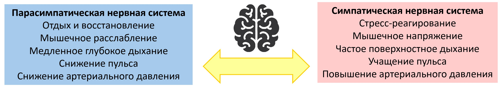

Нейросети нашего мозга непрерывно трудятся, чтобы справляться со сложными задачами, которые ставит перед нами жизнь в социуме. Одна из ключевых задач мозга — это регуляция состояния организма. Например, нервная система поддерживает оптимальное артериальное давление, пульс, частоту и глубину дыхания, уровня глюкозы. Когда нам предстоит бежать кросс или участвовать в сложном совещании, мозг заранее активирует организм, задействуя так называемую симпатическую нервную систему, ответственную за стресс-реагирование. Дыхание учащается, пульс повышается, мышцы напрягаются — мы готовы достигать целей, защищать себя или же быстро убегать от слишком сильного врага. Наоборот, когда предстоит отдых, мозг переводит наш организм в режим восстановления, задействуя парасимпатическую нервную систему. Дыхание становится ровным и глубоким, пульс снижается, мышцы расслабляются, улучшается пищеварение — в этом состоянии мы приходим в себя после стресса.

Упреждающую регуляцию состояния организма называют аллостазом. Задача аллостаза состоит в том, чтобы наше состояние всё время отвечало текущим задачам. Когда мы в опасности или же решаем трудную задачу, не время расслабляться. Но и во время отдыха ни к чему оставаться в напряжении. Аллостаз очень тесно связан с регуляцией эмоций. Например, когда мы злы или раздражены, активируется симпатическая нервная система, которая готовит нас к возможному противостоянию. Злость может мобилизовывать наши силы. Тревога, страх, боль также включают симпатическую нервную систему. Когда мы достигли своих целей, обеспечили себе безопасность и пребываем в спокойном и довольном состоянии, активируется парасимпатическая нервная система. Бывает и так, что мы понимаем, что не всё в жизни происходит так, как хотелось бы, но можем это принять — с грустью, но без обиды на мир и людей. Такое состояние принятия тоже способствует активации парасимпатической нервной системы. В состоянии принятия бывает грустно, но эта светлая грусть не разрушает нас, а делает мудрее.

Наши эмоции подсказывают нам, что с нами происходит, что для нас важно, в чём наши потребности. Например, мы злимся, когда не получается достичь чего-то нужного. Злость и указывает на неудовлетворённую потребность, и даёт энергию для движения в эту сторону, активируя наше тело. Если жить в мире со своими эмоциями, они будут помогать понимать себя и становиться счастливее. Однако не всегда так получается. Одна частых трудностей в регуляции эмоций называется алекситимией. Алекситимия представляет собой трудности понимания и выражения эмоций. Алекситимичным людям бывает трудно сказать, что и почему они чувствуют. Из-за отсутствия контакта с эмоциями такие люди могут жить как бы отдельно от своего тела, периодически удивляясь неприятным сюрпризам вроде сердцебиения или повышения артериального давления. По данным крупных исследований, алекситимия в 1.5 раза повышает риски сердечно-сосудистых заболеваний, таких как гипертония, инфаркт миокарда и инсульт. Наши работы показали, что алекситимия также повышает риск ЦМА, негативно влияя на состояние мозга.

Другая, к сожалению, нередкая проблема в регуляции эмоций — это депрессия. По статистике, __% людей в течение жизни сталкиваются с этим состоянием. В депрессии снижается настроение, падает уровень энергии, становится трудно справляться с рабочими и бытовыми задачами. Для депрессии типичны склонность к самокритике, чувство вины. С точки зрения эмоций, в депрессии энергия агрессии направляется на себя в форме недовольства собою, а не в мир в форме достижения целей и движения вперёд. В таком состоянии можно застрять, оно сопровождается изменениями в работе нейросетей и нейромедиаторов, которые требуют специального лечения. Помимо клинически выраженной депрессии, являющейся диагнозом, часто встречаются состояния меньшей интенсивности — не настолько тяжелые, чтобы слечь в кровать, но мешающие в полной мере радоваться жизни и быть максимально продуктивным. Депрессия, как и алекситимия, является сосудистым фактором риска. Более того, недавно было показано, что психотерапия депрессии уменьшает риски сердечно-сосудистых заболеваний. Наши исследования показали, что депрессивные симптомы, даже не достигающие клинической выраженности, негативно влияют на мозг, повышая риск ЦМА.

Интероцепция

ссылки
